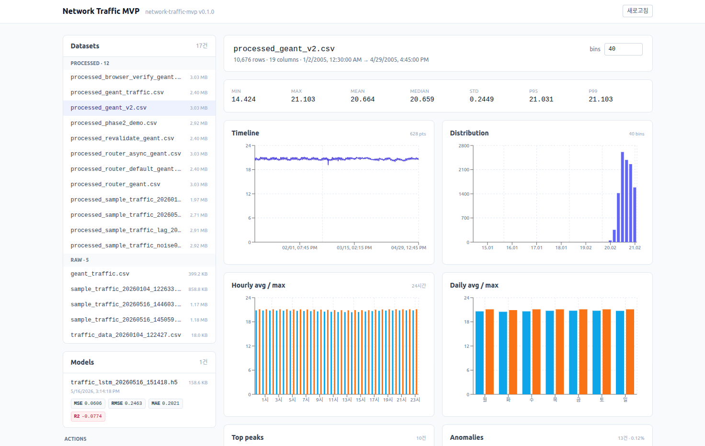

# Network Traffic MVP

네트워크 트래픽 데이터를 **수집 · 전처리 · 학습 · 예측 · 시각화**하는 단일 사용자 풀스택 MVP입니다. FastAPI 백엔드와 React + Vite 프론트엔드가 한 `uvicorn` 프로세스에서 운영됩니다.



> 좌측 사이드바에서 데이터셋·모델을 선택하고, 우측에서 분석/예측 결과를 확인하는 단일 화면 워크플로우.

---

## 주요 기능

- **데이터셋 관리** — CSV 업로드 / raw·processed 목록 / 자동 갱신
- **전처리 프리셋** — `default`(1분 간격) · `geant`(15분 간격, log1p + lag features)
- **LSTM 학습** — 시퀀스 누설 차단, EarlyStopping, 진행률 폴링
- **시계열 예측** — 학습된 모델 캐싱 + scaler `feature_names_in_` 사전검증
- **통계 분석** — 분포 / 시간대별 / 요일별 / 피크 / 이상치 (Z-score)
- **시각화** — Recharts 기반 분포 · 타임라인 · 예측 차트
- **잡 시스템** — 단일 슬롯 백그라운드 잡 + 적응형 폴링(800ms / 2.5s)

---

## 프로젝트 구조

```
network_traffic_project/
├── backend/                          # FastAPI 애플리케이션
│   ├── app/
│   │   ├── main.py                   # FastAPI + SPA fallback
│   │   ├── api/                      # HTTP 라우터 (health/datasets/train/predict/models/jobs)
│   │   ├── core/state.py             # JobRegistry (단일 슬롯)
│   │   ├── schemas/common.py         # Pydantic out 모델
│   │   └── services/                 # 도메인 어댑터 (preprocessing/training/prediction/analysis)
│   ├── utils/                        # 도메인 모듈 (CLI 단독 사용 가능)
│   │   ├── data_collector.py
│   │   ├── data_processor.py
│   │   └── visualizer.py
│   ├── train_model.py                # TrafficPredictor (LSTM)
│   ├── predict.py                    # TrafficForecaster
│   ├── analyze_traffic.py
│   ├── generate_sample_data.py
│   ├── config.py                     # 경로/하이퍼파라미터
│   ├── requirements.txt
│   ├── data/{raw,processed,predictions}/
│   └── models/                       # *.h5 / *_scaler.pkl / *_metrics.json
├── frontend/                         # React + Vite + Tailwind
│   ├── src/
│   │   ├── App.tsx
│   │   ├── api.ts / hooks.ts / types.ts
│   │   └── components/
│   │       ├── DatasetList.tsx
│   │       ├── ModelList.tsx
│   │       ├── Actions.tsx           # Preprocess / Train / Predict
│   │       ├── Analysis.tsx
│   │       ├── Predictions.tsx
│   │       └── JobBanner.tsx
│   └── package.json
├── docs/
│   ├── architecture.md               # 전체 아키텍처 문서
│   └── uml.md                        # Mermaid 다이어그램 모음
└── README.md
```

전체 설계는 [`docs/architecture.md`](docs/architecture.md), 다이어그램은 [`docs/uml.md`](docs/uml.md).

---

## 기술 스택

| 영역 | 사용 기술 |
|------|-----------|
| Backend | FastAPI · uvicorn · Pydantic v2 |
| ML | TensorFlow/Keras · scikit-learn · pandas · numpy · joblib |
| 수집/시각화 | psutil · matplotlib · seaborn |
| Frontend | React 18 · TypeScript · Vite · Tailwind CSS · Recharts |

---

## 설치

### 1) Backend

```bash
cd backend
python -m venv .venv && source .venv/bin/activate
pip install -r requirements.txt
```

### 2) Frontend

```bash
cd frontend
npm install
```

---

## 실행

### 개발 모드 (두 프로세스)

```bash
# 터미널 1 — 백엔드 (FastAPI)
cd backend
uvicorn app.main:app --reload --port 8000

# 터미널 2 — 프론트엔드 (Vite dev server)
cd frontend
npm run dev      # http://localhost:5173 (api → :8000 프록시)
```

### 프로덕션 모드 (단일 프로세스)

```bash
cd frontend && npm run build      # frontend/dist 생성
cd ../backend && uvicorn app.main:app --port 8000
# http://localhost:8000 에서 SPA + API 동시 서빙
```

빌드된 `frontend/dist`가 존재하면 `uvicorn`이 같은 포트로 정적 자산을 같이 서빙합니다 (`backend/app/main.py`).

---

## 사용 워크플로우

1. **CSV 업로드** — 좌측 `Datasets` 패널에 raw CSV가 등록됨.
2. **전처리** — `Actions → Preprocess`. `default` 또는 `geant` 프리셋 선택 후 실행. 잡 진행률이 상단 배너에 표시됨.
3. **학습** — `Actions → Train`. processed 데이터셋 + epochs/batch/seq_len 지정. 완료 시 `models/` 에 `.h5` + scaler + metrics 저장.
4. **예측** — `Actions → Predict`. 모델/데이터셋/steps 선택 → 우측 패널에 예측 곡선.
5. **분석** — 데이터셋 선택 시 우측 `Analysis` 가 자동 갱신 (분포·시간대별·이상치).

---

## CLI 사용 (백엔드 단독)

웹 UI 없이도 동일 모듈을 CLI로 실행할 수 있습니다.

```bash
# 데이터 수집 (psutil)
python -m utils.data_collector --duration 300 --interval 1

# 트래픽 분석
python analyze_traffic.py --input data/raw/traffic_data.csv

# 모델 학습
python train_model.py --data data/processed/processed_*.csv --model lstm --epochs 50

# 예측
python predict.py --model models/traffic_lstm_<ts>.h5 --data data/processed/<x>.csv --steps 24
```

---

## API 요약

| Method | Path | 설명 |
|--------|------|------|
| GET    | `/api/health` | 헬스체크 |
| GET    | `/api/datasets` | raw + processed 목록 |
| POST   | `/api/datasets/upload` | CSV 업로드 (≤ 100MB) |
| POST   | `/api/datasets/{name}/process` | 전처리 잡 트리거 (202) |
| GET    | `/api/datasets/{name}/analysis` | 분석 결과 JSON |
| GET    | `/api/models` | 학습 산출물 목록 (+ metrics) |
| POST   | `/api/train` | 학습 잡 트리거 (202) |
| POST   | `/api/predict` | 예측 동기 실행 |
| GET    | `/api/jobs/active` | 현재 실행 중인 잡 (또는 null) |
| GET    | `/api/jobs/{id}` | 잡 상세 |

상세 스키마는 `http://localhost:8000/docs` (FastAPI 자동 문서).

---

## 설계 하이라이트

- **단일 슬롯 잡**: `JobRegistry` 가 동시에 1개 잡만 허용 (TF 세션/디스크 IO 충돌 방지). HTTP 409 로 충돌 보고.
- **TF lazy import**: 라우터/서비스 모듈 최상단에서 TF 를 import 하지 않아 uvicorn 부팅이 빠름.
- **시계열 누설 차단**: `TrafficPredictor.prepare_data` 가 target 의 구성요소/파생값을 학습 feature 에서 제외하고, scaler 를 train 슬라이스로만 fit.
- **Forecaster 캐싱**: 동일 모델 재예측 시 `.h5` + scaler 로딩 비용 절약. 학습 트리거 시 무효화.
- **Feature 사전검증**: scaler 의 `feature_names_in_` 를 권위로 삼아 누락 컬럼을 명확한 400 에러로 변환.

---

## 라이선스

[MIT](LICENSE)
