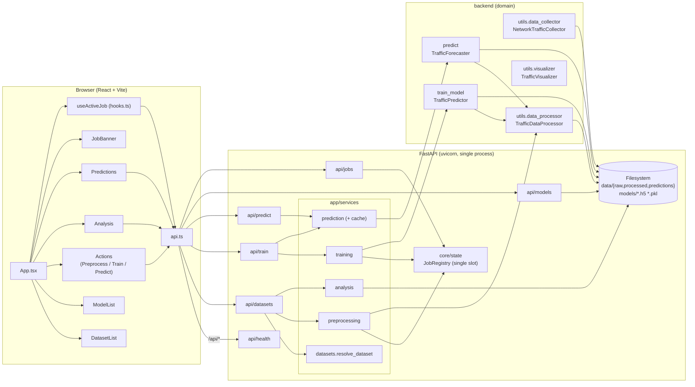
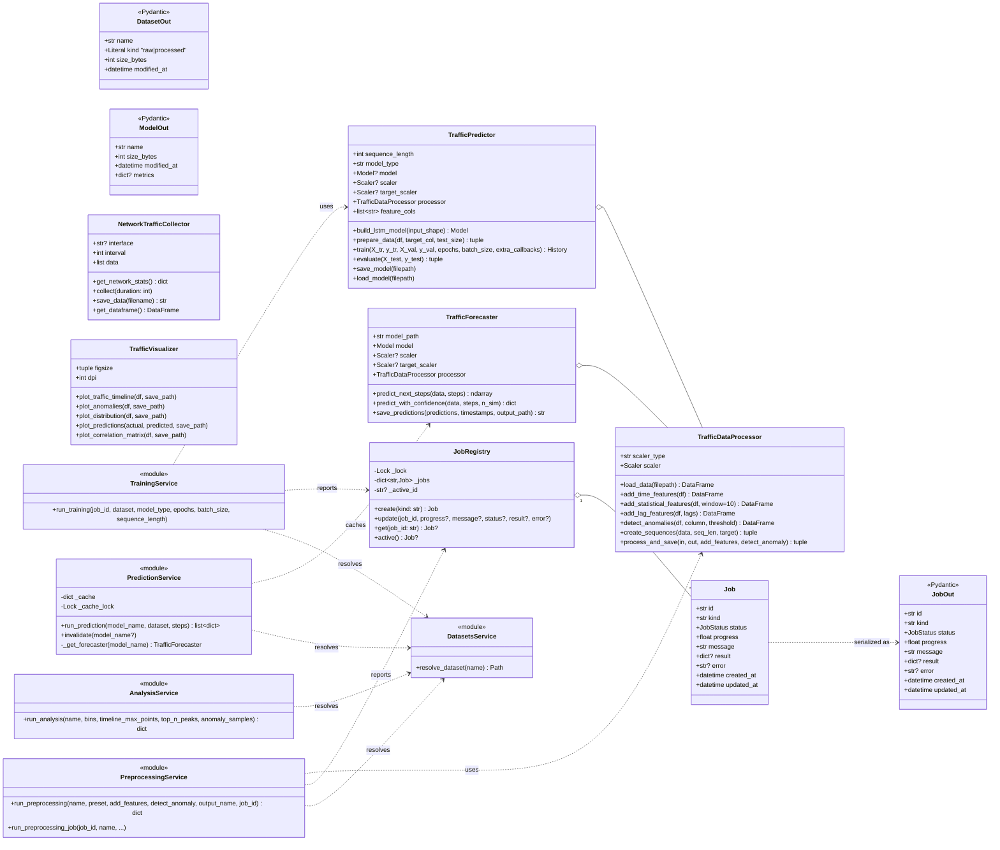
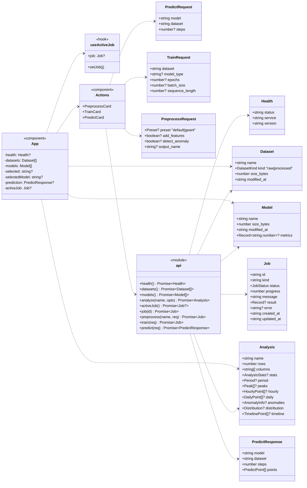
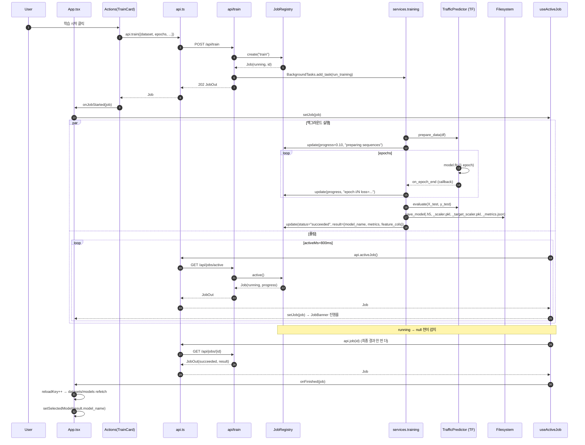
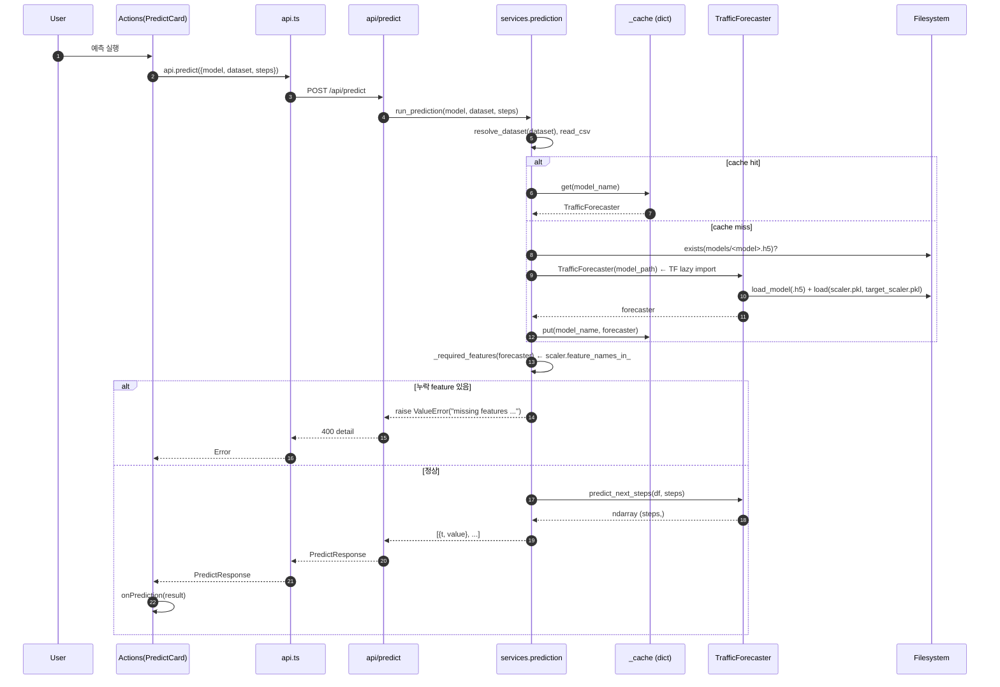
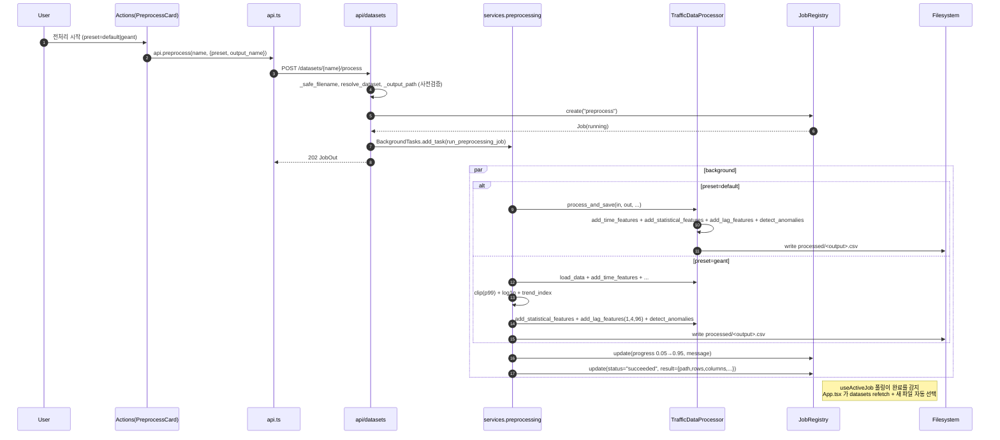
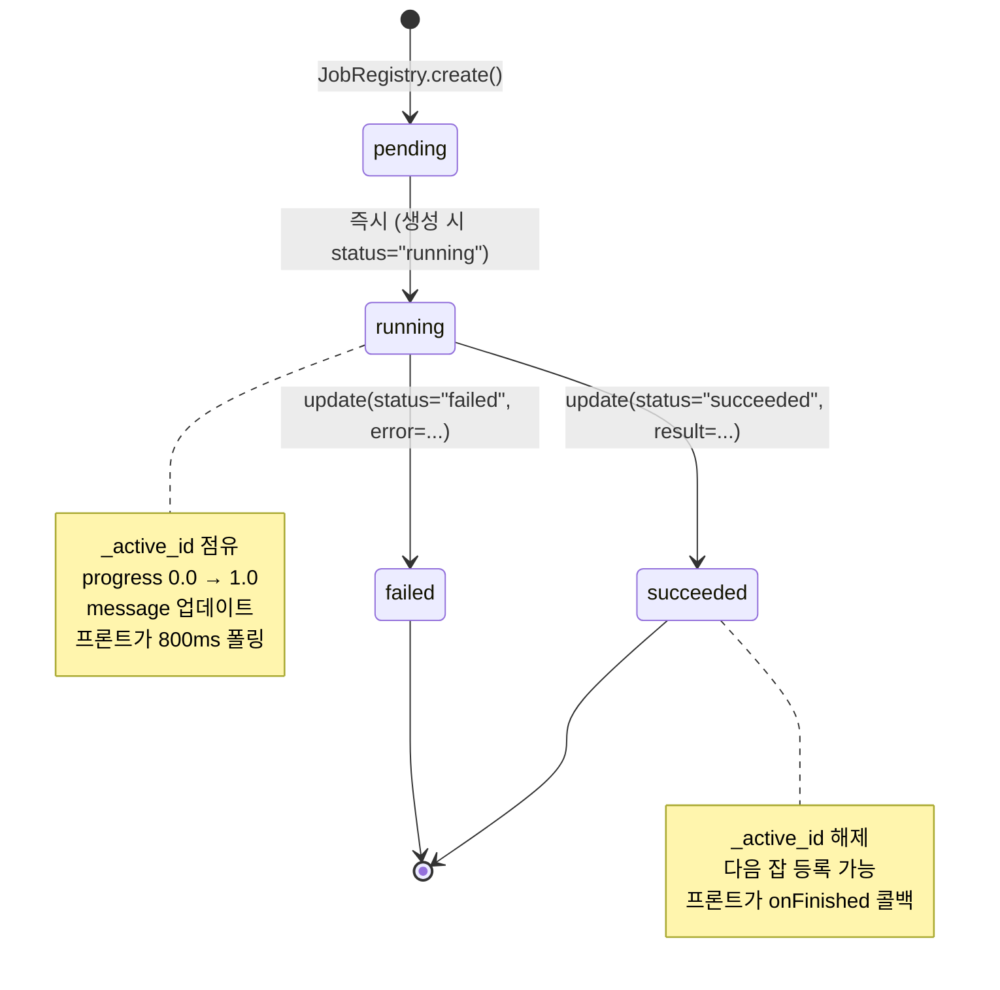
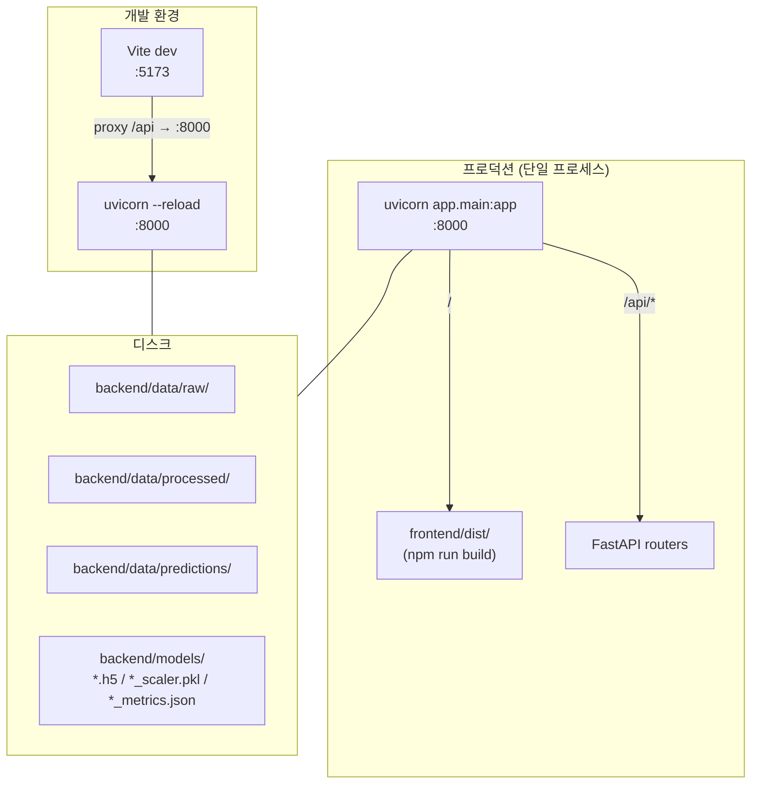

# UML — Network Traffic MVP

Mermaid 기반 UML 다이어그램 모음. GitHub/VSCode/PyCharm Markdown 프리뷰에서 그대로 렌더된다.

> 모든 도메인/서비스 이름은 `backend/`와 `frontend/src/` 의 실제 모듈에서 가져왔다.

---

## 1. 컴포넌트 다이어그램

시스템 전체 구성과 의존 방향을 한 장에 표현.

---

## 2. 클래스 다이어그램 — 백엔드 핵심

도메인·서비스·상태의 주요 클래스. Pydantic out 모델은 데이터 전송 형태 표현용.

---

## 3. 클래스 다이어그램 — 프론트엔드 타입

`frontend/src/types.ts` 의 도메인 객체와 컴포넌트 의존을 정리한 도식.

---

## 4. 시퀀스 다이어그램 — 학습 잡

`POST /api/train` 호출부터 진행률 폴링·완료 처리까지.

---

## 5. 시퀀스 다이어그램 — 예측 (동기)

---

## 6. 시퀀스 다이어그램 — 전처리 잡

---

## 7. 상태 다이어그램 — Job 라이프사이클

`JobRegistry.create`는 점유 중이면 `RuntimeError`를 던지고, 라우터가 이를 HTTP 409로 변환한다.

---

## 8. 배포 다이어그램

dev에서는 두 프로세스(Vite + uvicorn), prod에서는 uvicorn 하나로 정적 자산과 API를 모두 처리한다 (`backend/app/main.py:36-56`).
